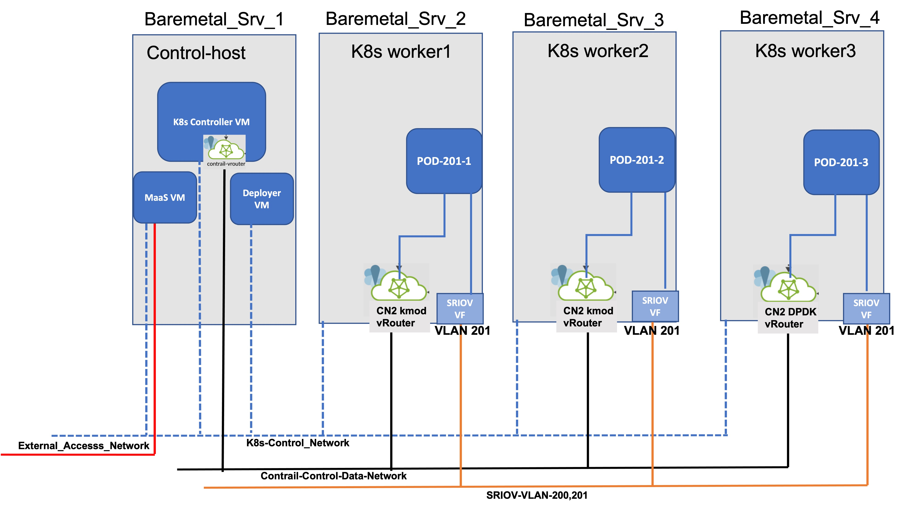

# SRIOV VF Plumbing into K8s PODs

## Problem Statement
[SRIOV_Basics](https://www.intel.com/content/www/us/en/developer/articles/technical/configure-sr-iov-network-virtual-functions-in-linux-kvm.html)
* In  few of earlier blogs [Git Home Page](https://github.com/kashif-nawaz?tab=repositories) I have discussed  the needs for bare metal to run containerized work loads / network functions (CNF).
* Running CNF (k8s cluster) over bare metals is not enough until performance mode networking capabilities are not plumbed into containerized work loads.
* If  a containerized work load supports  DPDK;   then attachment of such POD with K8s worker nodes DPDK PMD bound interface could suffice the network throughput requirements. 
* What if a containerized work load does not support DPDK but still require high throughput network interfaces.
## Solution
* SRIOV CNI solves the above described problem with plumbing  SRIOV VFs into Containerized workloads. 
## Implementation Details 
   
  ### Work Flow:-
  - Bootstrap your infrastructure with your favourite tool.
  - Bring up K8s cluster with your favourite deployment method.
  - Add your favourite CNI into K8s cluster.
  - Ensure that Multus (meta CNI) is also enabled on k8s cluster.
  - Enable SRIOV capabilities on required worker node by adding required parameters into the grub.
  - Create required number of SRIOV virtual functions. 
  - Create/ Copy SRIOV CNI Binary into worker nodes 
  - Create SRIOV CNI ConfigMap.
  - Add SRIOV CNI Plugin into k8s cluster.
  - Verify if SRIOV VFs are available as an allocatable resource from a particular worker node.
  - Create SRIOV Network Attachment Defination (NAD) file.
  - Create POD by referring SRIOV network created via SRIOV NAD.
  - POD Creation and SRIOV VF attachment verification
  - End to End Connectivity verification.
  ### Boot Strapping Infrasture 
  * How to bootstrap bare metal and virtualized infrastructure with the help of Canonical MaaS [Juniper_CN2_K8s_Over_MaaS_Managed_Infra
](https://github.com/kashif-nawaz/Juniper_CN2_K8s_Over_MaaS_Managed_Infra) 
  ### Bring UP K8s Cluster 
  * In the above wiki I have also discussed how to bring up k8s cluster by using Kube spray, then adding Juniper Networks Cloud Native CNI (CN2) with  Multus CNI enabled in the cluster. 
  ### Enabling SRIOV Capabilities into Worker Nodes and Creating SRIOV VFs
  * In wiki [Extending-SRIOV-VFs-to-Containers
](https://github.com/kashif-nawaz/Extending-SRIOV-VFs-to-Containers) I have discussed how to enable SRIOV capabilities in host OS and then creating SRIOV VFs which can survive machine reboot.
  ### Create / Copy SRIOV CNI Binary Into Worker Nodes
  * SRIOV CNI binary needs to be built on each worker node by following the instructions given in [Ref](https://github.com/openshift/sriov-cni)
  * If you don't have proper Go development enviornment then this binary build process will fail and in that case you need to manually copy the SRIOV binary into your enviornmet.  
  * I have uploaded SRIOV CNI Binary to this wiki and it should be copied to each worker node in /opt/cni/bin/ dir. 
  ### Create SRIOV CNI ConfigMap
  * In order to create configMap you need to know detail information for SRIOV VFs created over NIC of a particular worker node.
```
sudo lshw -c network -businfo 
Bus info          Device      Class          Description
========================================================
pci@0000:01:00.0  eno1        network        Ethernet Controller 10-Gigabit X540-AT2
pci@0000:01:00.1  eno2        network        Ethernet Controller 10-Gigabit X540-AT2
pci@0000:01:10.1  eno2v0      network        X540 Ethernet Controller Virtual Function
pci@0000:01:10.3  eno2v1      network        X540 Ethernet Controller Virtual Function
pci@0000:01:10.5  eno2v2      network        X540 Ethernet Controller Virtual Function
pci@0000:01:10.7  eno2v3      network        X540 Ethernet Controller Virtual Function
pci@0000:01:11.1  eno2v4      network        X540 Ethernet Controller Virtual Function
pci@0000:01:11.3  eno2v5      network        X540 Ethernet Controller Virtual Function
pci@0000:01:11.5  eno2v6      network        X540 Ethernet Controller Virtual Function
pci@0000:01:11.7  eno2v7      network        X540 Ethernet Controller Virtual Function
pci@0000:08:00.0  eno3        network        I350 Gigabit Network Connection
pci@0000:08:00.1  eno4        network        I350 Gigabit Network Connection
                  pkt0        network        Ethernet interface
                  vhost0      network        Ethernet interface
                  kube-ipvs0  network        Ethernet interface
```
* Above Snippet shows SRIOV VFs are crated over en02 from v0-v7.
* Let's get some information about any VF depticted above and we will refer that information in SRIOV ConfigMap.
```
lspci  -vmmkns 01:10.1
Slot:	01:10.1
Class:	0200
Vendor:	8086
Device:	1515
SVendor:	1028
SDevice:	1f61
Rev:	01
Driver:	ixgbevf
Module:	ixgbevf
NUMANode:	0
```
* Device code information for [Intel Devices](https://pci-ids.ucw.cz/read/PC/8086)
* Construct the SRIOV ConfigMap based on the above information  and create it with kubectl command.
```
cat sriovintel-config.yaml
apiVersion: v1
kind: ConfigMap
metadata:
  name: sriovdp-config
  namespace: kube-system
data:
  config.json: |
    {
        "resourceList": [{
                "resourceName": "intel_sriov_netdevice",
                "selectors": {
                    "vendors": ["8086"],
                    "devices": ["1515"],
                    "drivers": ["ixgbevf"]
                }
            }
        ]
    }
 kubectl create -f sriovintel-config.yaml
  ```

  ### Add SRIOV CNI Plugin into K8s Cluster
  * Clon the git wiki [sriov-network-device-plugin
](https://github.com/k8snetworkplumbingwg/sriov-network-device-plugin) in your environment. 
  * Cretae  SRIOV Plugin daemonset.
  ```
  kubectl create -f ./sriov-network-device-plugin/deployments/k8s-v1.16/sriovdp-daemonset.yaml
  ```
  * Veirfy SRIOV Plugin Status.

  ```
  kubectl get pods -A -o wide |grep 'sriov-device-plugin'
  kube-system       kube-sriov-device-plugin-amd64-2b2k4        1/1     Running             1 (23h ago)      44h     192.168.24.114   worker2                 
  kube-system       kube-sriov-device-plugin-amd64-2k8ks        1/1     Running             1 (23h ago)      44h     192.168.24.115   worker3                
  kube-system       kube-sriov-device-plugin-amd64-4vklh        1/1     Running             0                44h     192.168.24.112   controller1   
  kube-system       kube-sriov-device-plugin-amd64-vszsw        1/1     Running             1 (36h ago)      44h     192.168.24.113   worker1 
  ``` 
  * Verify if SRIOV VFs are available as an allocatable resource from a particular worker node.

```
    kubectl get node worker1 -o json | jq '.status.allocatable'
        {
    "cpu": "23900m",
    "ephemeral-storage": "529563926061",
    "hugepages-1Gi": "16Gi",
    "intel.com/intel_sriov_netdevice": "8",
    "memory": "114890332Ki",
    "pods": "110"
    }

    kubectl get node worker2 -o json | jq '.status.allocatable'
    {
    "cpu": "23900m",
    "ephemeral-storage": "516960471004",
    "hugepages-1Gi": "16Gi",
    "intel.com/intel_sriov_netdevice": "8",
    "memory": "114890336Ki",
    "pods": "110"
    }

    kubectl get node worker3 -o json | jq '.status.allocatable'
    {
    "cpu": "31900m",
    "ephemeral-storage": "1061284683658",
    "hugepages-1Gi": "16Gi",
    "intel.com/intel_sriov_netdevice": "8",
    "memory": "114890336Ki",
    "pods": "110"
    }
```
* In the above snippet '"intel.com/intel_sriov_netdevice": "8" ' means that  in each worker node SRIOV Plugin has detected  8 SRIOV VFs and marked those SRIOV VFs as allocatable resources. 
  ### Create SRIOV Network Attachment Defination (NAD) file

```
cat sriov-nad-201.yaml
---
apiVersion: "k8s.cni.cncf.io/v1"
kind: NetworkAttachmentDefinition
metadata:
  name: sriov-201
  namespace: default
  annotations:
    k8s.v1.cni.cncf.io/resourceName: intel.com/intel_sriov_netdevice
spec:
  config: |
    {
        "type": "sriov",
        "cniVersion": "0.3.1",
        "vlan": 201,
        "name": "sriov-201",
        "ipam": {
          "type": "host-local",
          "ranges": [[{
              "subnet": "192.168.201.0/24"
          }]]
        }
    }
  ```

  ### Create POD with SRIOV VF Plumbed In 
  
  * A POD will be created on  each worker node by referring SRIOV network created via the above described NAD file.
  * Pod definition files:- 

```
cat sriov-pod-201-1.yaml
apiVersion: v1
kind: Pod
metadata:
  name: sriov-pod-201-1
  annotations:
    k8s.v1.cni.cncf.io/networks: |-
       [
         {
            "name":"sriov-201",
            "ips":["192.168.201.2"],
            "interface":"net1"

         }
       ]
spec:
  containers:
  - name: sriov-pod-200-1c
    image: busybox:1.28
    imagePullPolicy: IfNotPresent
    command: ['sh', '-c', 'echo The app is running! && sleep 3600']
    resources:
     requests:
       intel.com/intel_sriov_netdevice: '1'
     limits:
       intel.com/intel_sriov_netdevice: '1'
    securityContext:
       privileged: true
  nodeName: worker1

cat sriov-pod-201-2.yaml
apiVersion: v1
kind: Pod
metadata:
  name: sriov-pod-201-2
  annotations:
    k8s.v1.cni.cncf.io/networks: |-
       [
         {
            "name":"sriov-201",
            "ips":["192.168.201.3"],
            "interface":"net1"

         }
       ]
spec:
  containers:
  - name: sriov-pod201-2c
    image: busybox:1.28
    imagePullPolicy: IfNotPresent
    command: ['sh', '-c', 'echo The app is running! && sleep 3600']
    resources:
     requests:
       intel.com/intel_sriov_netdevice: '1'
     limits:
       intel.com/intel_sriov_netdevice: '1'
    securityContext:
       privileged: true
  nodeName: worker2


cat sriov-pod-201-3.yaml
apiVersion: v1
kind: Pod
metadata:
  name: sriov-pod-201-3
  annotations:
    k8s.v1.cni.cncf.io/networks: |-
       [
         {
            "name":"sriov-201",
            "ips":["192.168.201.4"],
            "interface":"net1"

         }
       ]
spec:
  containers:
  - name: sriov-pod-201-3c
    image: busybox:1.28
    imagePullPolicy: IfNotPresent
    command: ['sh', '-c', 'echo The app is running! && sleep 3600']
    resources:
     requests:
       intel.com/intel_sriov_netdevice: '1'
     limits:
       intel.com/intel_sriov_netdevice: '1'
    securityContext:
       privileged: true
  nodeName: worker3

```
### POD Creation Verifications
* Verify PODs Creation.

```
kubectl get pods -o wide | grep sriov
sriov-pod-201-1        1/1     Running             14 (20m ago)    14h   10.233.65.0   worker1   <none>           <none>
sriov-pod-201-2        1/1     Running             14 (6m2s ago)   14h   10.233.66.0   worker2   <none>           <none>
sriov-pod-201-3        1/1     Running             13 (49m ago)    13h   10.233.67.1   worker3   <none>           <none>

```
* Login into Container to check if SRIOV VF is attached to the Container or not.
```
kubectl exec sriov-pod-201-1 -- ip addr
1: lo: <LOOPBACK,UP,LOWER_UP> mtu 65536 qdisc noqueue qlen 1000
    link/loopback 00:00:00:00:00:00 brd 00:00:00:00:00:00
    inet 127.0.0.1/8 scope host lo
       valid_lft forever preferred_lft forever
    inet6 ::1/128 scope host
       valid_lft forever preferred_lft forever
7: net1: <BROADCAST,MULTICAST,UP,LOWER_UP> mtu 1500 qdisc mq qlen 1000
    link/ether 56:7f:f1:5e:ac:52 brd ff:ff:ff:ff:ff:ff
    inet 192.168.201.2/24 brd 192.168.201.255 scope global net1
       valid_lft forever preferred_lft forever
    inet6 fe80::547f:f1ff:fe5e:ac52/64 scope link
       valid_lft forever preferred_lft forever
32: eth0@if33: <BROADCAST,MULTICAST,UP,LOWER_UP,M-DOWN> mtu 1500 qdisc noqueue
    link/ether 02:d0:b6:cc:63:73 brd ff:ff:ff:ff:ff:ff
    inet 10.233.65.0/18 brd 10.233.127.255 scope global eth0
       valid_lft forever preferred_lft forever
    inet6 fe80::1c3b:b8ff:fedd:28e6/64 scope link
       valid_lft forever preferred_lft forever

 kubectl exec sriov-pod201-2 -- ip addr
1: lo: <LOOPBACK,UP,LOWER_UP> mtu 65536 qdisc noqueue qlen 1000
    link/loopback 00:00:00:00:00:00 brd 00:00:00:00:00:00
    inet 127.0.0.1/8 scope host lo
       valid_lft forever preferred_lft forever
    inet6 ::1/128 scope host
       valid_lft forever preferred_lft forever
8: net1: <BROADCAST,MULTICAST,UP,LOWER_UP> mtu 1500 qdisc mq qlen 1000
    link/ether 0a:43:80:e7:80:15 brd ff:ff:ff:ff:ff:ff
    inet 192.168.201.3/24 brd 192.168.201.255 scope global net1
       valid_lft forever preferred_lft forever
    inet6 fe80::843:80ff:fee7:8015/64 scope link
       valid_lft forever preferred_lft forever
34: eth0@if35: <BROADCAST,MULTICAST,UP,LOWER_UP,M-DOWN> mtu 1500 qdisc noqueue
    link/ether 02:08:a8:ef:19:70 brd ff:ff:ff:ff:ff:ff
    inet 10.233.66.0/18 brd 10.233.127.255 scope global eth0
       valid_lft forever preferred_lft forever
    inet6 fe80::38d8:88ff:fec6:c93c/64 scope link
       valid_lft forever preferred_lft forever

 kubectl exec sriov-pod-201-3 -- ip addr
1: lo: <LOOPBACK,UP,LOWER_UP> mtu 65536 qdisc noqueue qlen 1000
    link/loopback 00:00:00:00:00:00 brd 00:00:00:00:00:00
    inet 127.0.0.1/8 scope host lo
       valid_lft forever preferred_lft forever
    inet6 ::1/128 scope host
       valid_lft forever preferred_lft forever
13: net1: <BROADCAST,MULTICAST,UP,LOWER_UP> mtu 1500 qdisc mq qlen 1000
    link/ether a2:1f:bc:be:1c:7e brd ff:ff:ff:ff:ff:ff
    inet 192.168.201.4/24 brd 192.168.201.255 scope global net1
       valid_lft forever preferred_lft forever
    inet6 fe80::a01f:bcff:febe:1c7e/64 scope link
       valid_lft forever preferred_lft forever
20: eth0@if21: <BROADCAST,MULTICAST,UP,LOWER_UP,M-DOWN> mtu 1500 qdisc noqueue
    link/ether 02:6e:05:f8:d5:e3 brd ff:ff:ff:ff:ff:ff
    inet 10.233.67.1/18 brd 10.233.127.255 scope global eth0
       valid_lft forever preferred_lft forever
    inet6 fe80::70a6:6bff:fef6:82c3/64 scope link
       valid_lft forever preferred_lft forever
```
 
### SRIOV VF attachment verfication 
* SRIOV CNI will not only attach the VFs with K8s PODs but will also dynamically configure the VLAN ID over the corresponding VF if VLAN ID was referred in NAD file.
  - SRIOV-POD-201-1 is created on Worker1 
```
ip link show 
eno2: <BROADCAST,MULTICAST,UP,LOWER_UP> mtu 9000 qdisc mq state UP mode DEFAULT group default qlen 1000
    link/ether bc:30:5b:f2:87:52 brd ff:ff:ff:ff:ff:ff
    vf 0     link/ether fa:ad:48:dd:e4:3d brd ff:ff:ff:ff:ff:ff, spoof checking on, link-state auto, trust off, query_rss off
    vf 1     link/ether 56:7f:f1:5e:ac:52 brd ff:ff:ff:ff:ff:ff, vlan 201, spoof checking on, link-state auto, trust off, query_rss off
    vf 2     link/ether d6:fb:63:84:07:6d brd ff:ff:ff:ff:ff:ff, spoof checking on, link-state auto, trust off, query_rss off
    vf 3     link/ether 62:d0:9f:26:c9:81 brd ff:ff:ff:ff:ff:ff, spoof checking on, link-state auto, trust off, query_rss off
    vf 4     link/ether c6:6c:f4:56:14:80 brd ff:ff:ff:ff:ff:ff, spoof checking on, link-state auto, trust off, query_rss off
    vf 5     link/ether 2e:e1:6f:3c:d0:0d brd ff:ff:ff:ff:ff:ff, spoof checking on, link-state auto, trust off, query_rss off
    vf 6     link/ether 3a:7f:23:60:3b:a6 brd ff:ff:ff:ff:ff:ff, spoof checking on, link-state auto, trust off, query_rss off
    vf 7     link/ether 9a:84:fa:0a:f5:5f brd ff:ff:ff:ff:ff:ff, spoof checking on, link-state auto, trust off, query_rss off
```
- SRIOV-POD-201-2 is created on Worker2
```
ip link show
5: eno2: <BROADCAST,MULTICAST,UP,LOWER_UP> mtu 9000 qdisc mq state UP mode DEFAULT group default qlen 1000
    link/ether bc:30:5b:f2:3f:72 brd ff:ff:ff:ff:ff:ff
    vf 0     link/ether 02:17:de:d3:49:70 brd ff:ff:ff:ff:ff:ff, spoof checking on, link-state auto, trust off, query_rss off
    vf 1     link/ether ee:e1:21:00:71:dc brd ff:ff:ff:ff:ff:ff, spoof checking on, link-state auto, trust off, query_rss off
    vf 2     link/ether 0a:43:80:e7:80:15 brd ff:ff:ff:ff:ff:ff, vlan 201, spoof checking on, link-state auto, trust off, query_rss off
    vf 3     link/ether 82:b6:71:87:16:4d brd ff:ff:ff:ff:ff:ff, spoof checking on, link-state auto, trust off, query_rss off
    vf 4     link/ether 86:58:25:0a:66:51 brd ff:ff:ff:ff:ff:ff, spoof checking on, link-state auto, trust off, query_rss off
    vf 5     link/ether 9a:48:0d:ef:ab:13 brd ff:ff:ff:ff:ff:ff, spoof checking on, link-state auto, trust off, query_rss off
    vf 6     link/ether 02:4f:92:cc:b5:4f brd ff:ff:ff:ff:ff:ff, spoof checking on, link-state auto, trust off, query_rss off
    vf 7     link/ether 9e:ee:ab:11:10:87 brd ff:ff:ff:ff:ff:ff, spoof checking on, link-state auto, trust off, query_rss off
```
- SRIOV-POD-201-3 is created on Worker3

```
 ip link show
 eno2: <BROADCAST,MULTICAST,UP,LOWER_UP> mtu 9000 qdisc mq state UP mode DEFAULT group default qlen 1000
    link/ether bc:30:5b:f1:c2:02 brd ff:ff:ff:ff:ff:ff
    vf 0     link/ether 66:44:9f:be:ff:ca brd ff:ff:ff:ff:ff:ff, spoof checking on, link-state auto, trust off, query_rss off
    vf 1     link/ether 9e:9f:df:ed:60:93 brd ff:ff:ff:ff:ff:ff, spoof checking on, link-state auto, trust off, query_rss off
    vf 2     link/ether 6e:d7:ec:63:e7:ee brd ff:ff:ff:ff:ff:ff, spoof checking on, link-state auto, trust off, query_rss off
    vf 3     link/ether 9a:b6:af:80:b8:28 brd ff:ff:ff:ff:ff:ff, spoof checking on, link-state auto, trust off, query_rss off
    vf 4     link/ether 2e:45:c5:79:28:7c brd ff:ff:ff:ff:ff:ff, spoof checking on, link-state auto, trust off, query_rss off
    vf 5     link/ether 3e:c2:89:08:52:29 brd ff:ff:ff:ff:ff:ff, spoof checking on, link-state auto, trust off, query_rss off
    vf 6     link/ether a6:b7:4d:83:16:59 brd ff:ff:ff:ff:ff:ff, spoof checking on, link-state auto, trust off, query_rss off
    vf 7     link/ether a2:1f:bc:be:1c:7e brd ff:ff:ff:ff:ff:ff, vlan 201, spoof checking on, link-state auto, trust off, query_rss off
```

### End to End Connectivity Verification

* Run icmp ping toward VLAN-201 (subnet 192.168.201.0/24 gateway i.e 192.168.201.1) from each POD
```
kubectl exec sriov-pod-201-1 -- ping 192.168.201.1 -c1
PING 192.168.201.1 (192.168.201.1): 56 data bytes
64 bytes from 192.168.201.1: seq=0 ttl=64 time=2.455 ms

--- 192.168.201.1 ping statistics ---
1 packets transmitted, 1 packets received, 0% packet loss
round-trip min/avg/max = 2.455/2.455/2.455 ms

kubectl exec sriov-pod201-2 -- ping 192.168.201.1 -c1
PING 192.168.201.1 (192.168.201.1): 56 data bytes
64 bytes from 192.168.201.1: seq=0 ttl=64 time=9.939 ms

--- 192.168.201.1 ping statistics ---
1 packets transmitted, 1 packets received, 0% packet loss
round-trip min/avg/max = 9.939/9.939/9.939 ms

kubectl exec sriov-pod-201-3 -- ping 192.168.201.1 -c1
PING 192.168.201.1 (192.168.201.1): 56 data bytes
64 bytes from 192.168.201.1: seq=0 ttl=64 time=4.626 ms

--- 192.168.201.1 ping statistics ---
1 packets transmitted, 1 packets received, 0% packet loss
round-trip min/avg/max = 4.626/4.626/4.626 ms
```
* Check MAC/ ARP table of network switches to verify if PODs MACs / IPs for VLAN-201 and subnet 192.168.201.0/24 are learned on the switch or not.

```
show ethernet-switching table vlan SRIOV_201
Ethernet-switching table: 4 unicast entries
  VLAN	            MAC address       Type         Age Interfaces
  SRIOV_201         *                 Flood          - All-members
  SRIOV_201         0a:43:80:e7:80:15 Learn         54 ge-0/0/1.0
  SRIOV_201         56:7f:f1:5e:ac:52 Learn         36 ge-0/0/9.0
  SRIOV_201         a2:1f:bc:be:1c:7e Learn          0 ge-0/0/19.0
  SRIOV_201         ac:4b:c8:2b:77:c1 Static         - Router

lab@fabric-switch> show arp no-resolve | match 201.
56:7f:f1:5e:ac:52 192.168.201.2   vlan.201             none
0a:43:80:e7:80:15 192.168.201.3   vlan.201             none
a2:1f:bc:be:1c:7e 192.168.201.4   vlan.201             none
```